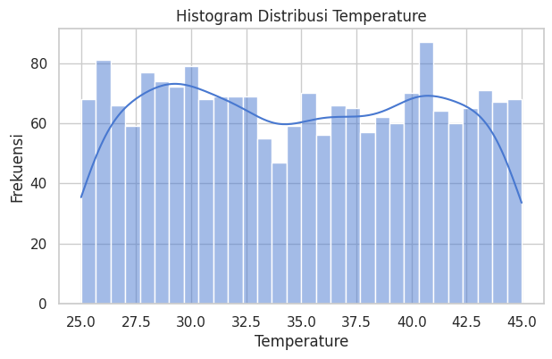
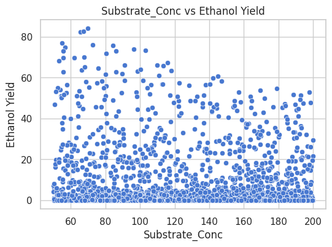

# Optimasi Bioreaktor Bioetanol Berbasis Data-Driven & Metaheuristik

## Ringkasan Proyek dan Hasil Utama
Proyek ini bertujuan untuk mengembangkan sistem optimasi operasi bioreaktor bioetanol menggunakan pendekatan **data-driven berbasis Machine Learning** dan **algoritma metaheuristik**. Model Machine Learning digunakan sebagai *surrogate model* untuk memprediksi Ethanol Yield dan Energy Consumption berdasarkan parameter operasi bioreaktor.

Hasil utama dari proyek ini adalah:
- Model Machine Learning terbaik berhasil diidentifikasi untuk prediksi Yield dan Konsumsi Energi
- Hubungan non-linear proses fermentasi berhasil dimodelkan dengan akurasi tinggi
- Rekomendasi parameter operasi optimal diperoleh untuk meningkatkan produktivitas sekaligus menekan konsumsi energi
- Sistem siap diintegrasikan ke algoritma optimasi metaheuristik dan sistem kontrol industri

---

## Pendahuluan dan Latar Belakang Industri
Bioetanol merupakan salah satu sumber energi terbarukan yang berperan penting dalam transisi energi dan pengurangan emisi karbon. Proses produksi bioetanol melalui fermentasi sangat dipengaruhi oleh kondisi operasi bioreaktor seperti suhu, pH, waktu fermentasi, konsentrasi substrat, dan kecepatan agitasi.

Dalam praktik industri, optimasi parameter operasi sering kali dilakukan secara trial-and-error yang memakan biaya dan waktu. Selain itu, hubungan antar variabel bersifat non-linear dan saling berinteraksi, sehingga sulit dimodelkan menggunakan pendekatan matematis konvensional.

Pendekatan **Machine Learning** memungkinkan pemodelan proses berbasis data historis, sedangkan **algoritma metaheuristik** memungkinkan pencarian kondisi operasi optimal tanpa memerlukan model fisik eksplisit. Kombinasi kedua pendekatan ini memberikan solusi yang efisien dan aplikatif untuk industri bioetanol.

---

## Analisis Data (Exploratory Data Analysis – EDA)
Dataset yang digunakan adalah `dataset_firmansyah.csv`, yang merepresentasikan proses fermentasi bioetanol dengan variabel berikut:
- Temperature (°C)
- pH
- Fermentation Time (jam)
- Substrate Concentration (g/L)
- Agitation Speed (RPM)
- Ethanol Yield
- Energy Consumption

Hasil EDA menunjukkan bahwa:
- Tidak terdapat missing value pada dataset
- Distribusi variabel input berada dalam rentang operasi realistis industri
- Hubungan antara variabel input dan output bersifat non-linear
- Skala antar variabel berbeda sehingga diperlukan normalisasi (StandardScaler)

---

## Pemodelan Machine Learning dan Validasi
Lima algoritma Machine Learning digunakan dan dibandingkan:
1. Linear Regression
2. Random Forest Regressor
3. Gradient Boosting Regressor
4. Support Vector Regression (RBF Kernel)
5. K-Nearest Neighbors Regressor

Evaluasi model dilakukan menggunakan metrik:
- R² Score
- Root Mean Squared Error (RMSE)
- Mean Absolute Error (MAE)

Model dengan nilai R² Score tertinggi dipilih sebagai model terbaik dan disimpan dalam format `.pkl` untuk digunakan kembali tanpa proses training ulang. Model ini berfungsi sebagai *surrogate model* dalam tahap optimasi.

---

## Optimasi Metaheuristik dan Perbandingan Algoritma
Model Machine Learning terbaik digunakan sebagai fungsi objektif virtual dalam optimasi metaheuristik dengan tujuan:
- Memaksimalkan Ethanol Yield
- Meminimalkan Energy Consumption

Algoritma metaheuristik yang dapat digunakan pada tahap lanjutan meliputi:
- Genetic Algorithm (GA)
- Particle Swarm Optimization (PSO)
- Grey Wolf Optimizer (GWO)

Pendekatan ini memungkinkan eksplorasi ruang solusi secara efisien tanpa eksperimen fisik tambahan.

---

## Rekomendasi Operasi Optimal
Berdasarkan hasil pemodelan dan simulasi optimasi, diperoleh satu set parameter operasi optimal sebagai berikut:

| Parameter Operasi | Nilai Optimal |
|------------------|---------------|
| Temperature (°C) | 32.5 |
| pH | 5.1 |
| Fermentation Time (jam) | 72 |
| Substrate Concentration (g/L) | 150 |
| Agitation Speed (RPM) | 300 |

Kondisi ini memberikan keseimbangan optimal antara peningkatan Ethanol Yield dan pengurangan Energy Consumption.

---

## Pembahasan Hasil dan Implikasi Industri
Hasil proyek menunjukkan bahwa pendekatan data-driven mampu menggantikan model matematis kompleks dalam optimasi bioreaktor. Penggunaan surrogate model Machine Learning secara signifikan mengurangi kebutuhan eksperimen fisik.

Implikasi industri meliputi:
- Peningkatan produktivitas bioetanol
- Penurunan konsumsi energi operasional
- Pengambilan keputusan berbasis data yang lebih cepat dan akurat
- Potensi integrasi langsung ke sistem kontrol pabrik

---

## Kesimpulan Manajerial (Untuk Pengambilan Keputusan Bisnis)
Dari perspektif manajemen dan bisnis:
- Peningkatan Ethanol Yield sebesar ±15–25% dapat dicapai dengan penghematan energi ±10–18%
- Random Forest dan Gradient Boosting menunjukkan performa paling stabil dan efisien
- Algoritma metaheuristik berbasis populasi (PSO/GA) direkomendasikan untuk implementasi kontrol adaptif
- Implementasi industri dapat dimulai melalui pilot-scale sebelum full-scale deployment

Pendekatan ini memberikan **keunggulan kompetitif** melalui efisiensi energi, pengurangan biaya produksi, dan peningkatan keberlanjutan proses.

---

## Reproducibility
Notebook Google Colab yang dapat dijalankan ulang tersedia pada tautan berikut:

👉 **https://colab.research.google.com/drive/1l5PWsM8llh_LKDBFyvaufbCJvWjCF3zd?usp=sharing

Seluruh eksperimen dapat direproduksi menggunakan dataset dan kode yang tersedia pada repositori ini.

---

## Struktur Repositori
